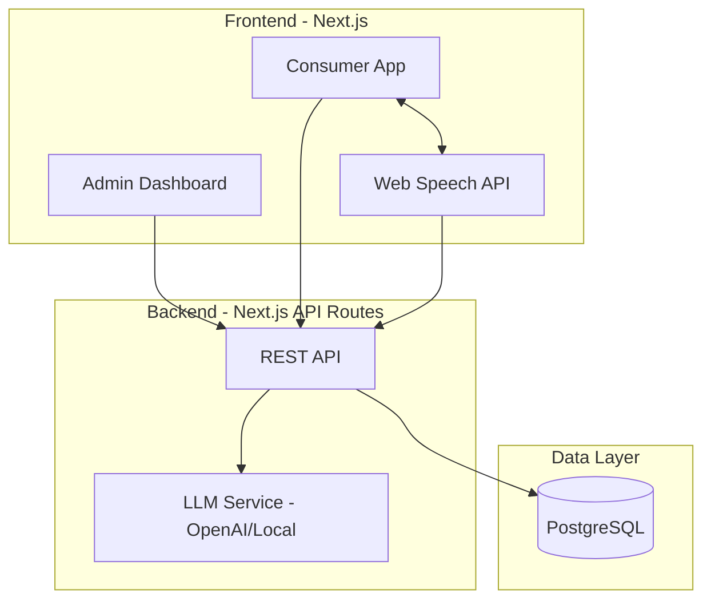
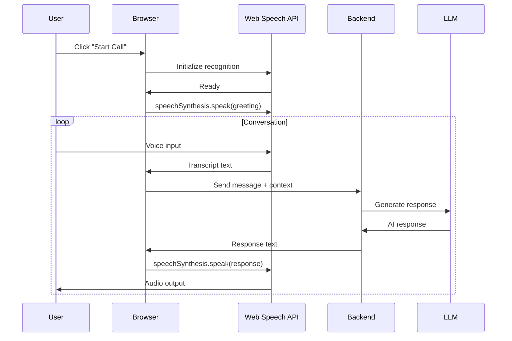

# AI Voice Bot Insurance Platform (Local Voice)

## Architecture Overview



## Tech Stack

- **Frontend**: Next.js 14 (App Router) + Tailwind CSS + shadcn/ui
- **Voice**: Web Speech API (SpeechRecognition + SpeechSynthesis)
- **Backend**: Next.js API Routes
- **Database**: PostgreSQL + Prisma
- **AI/LLM**: OpenAI API (or local LLM option)
- **Auth**: NextAuth.js

## Voice Implementation (Browser-Native)

Using Web Speech API for completely local voice interaction:



### Voice Selection Options

Browser's `speechSynthesis` provides multiple voices:
- System voices (varies by OS/browser)
- Language variants (en-US, en-GB, etc.)
- Male/Female options
- Speed and pitch controls

## Core Features

### 1. Admin Dashboard

**Bot Management**
- Create/edit/delete voice bots
- Assign bots to insurance categories
- Enable/disable bots

**Voice Configuration**
- Select from available system voices
- Configure speech rate (0.5x - 2x)
- Adjust pitch
- Preview voice before saving

**Prompt Configuration**
- System prompt editor with markdown support
- Variable placeholders: `{{userName}}`, `{{insuranceType}}`, etc.
- Conversation flow templates
- Test prompts directly in admin

**Simulated Call Triggers**
- Manual trigger for testing
- Schedule simulated calls
- Bulk trigger for demos

### 2. Consumer Web App

**Insurance Marketplace**
- Browse providers (Health, Auto, Life, Home)
- View plan details and pricing
- Request voice assistance

**Voice Interaction Interface**
- "Talk to Bot" button initiates conversation
- Real-time transcription display
- Visual voice activity indicator
- Mute/unmute controls
- End call button

**Guided Purchase Flow**
- Bot asks qualifying questions
- Collects user information via voice
- Displays quotes in real-time
- Guides to checkout

### 3. Conversation Engine

**LLM Integration**
- OpenAI GPT-4 for natural conversation
- Context injection (user profile, insurance data)
- Function calling for actions (get quote, save info)

**State Management**
- Conversation history per session
- User intent tracking
- Form data extraction from speech

## Database Schema

```
users
- id, email, phone, name, created_at

voice_bots
- id, name, voice_id, voice_settings (JSON), system_prompt, 
  insurance_types[], is_active, created_at

insurance_providers  
- id, name, logo_url, description, plan_types[]

insurance_plans
- id, provider_id, name, type, coverage, premium, details (JSON)

conversations
- id, user_id, bot_id, status, started_at, ended_at

messages
- id, conversation_id, role (user/assistant), content, 
  audio_duration, created_at

quotes
- id, conversation_id, plan_id, user_data (JSON), 
  quote_amount, status

policies
- id, user_id, plan_id, policy_number, start_date, 
  end_date, status
```

## Project Structure

```
voice-bot-insurance/
├── app/
│   ├── (admin)/
│   │   ├── dashboard/
│   │   ├── bots/
│   │   │   ├── page.tsx          # Bot listing
│   │   │   ├── [id]/page.tsx     # Bot editor
│   │   │   └── new/page.tsx      # Create bot
│   │   ├── calls/
│   │   └── analytics/
│   ├── (consumer)/
│   │   ├── page.tsx              # Home/marketplace
│   │   ├── providers/
│   │   ├── plans/
│   │   └── call/
│   │       └── [botId]/page.tsx  # Voice interaction
│   ├── api/
│   │   ├── bots/
│   │   ├── chat/
│   │   ├── quotes/
│   │   └── auth/
│   └── layout.tsx
├── components/
│   ├── admin/
│   ├── consumer/
│   ├── voice/
│   │   ├── VoiceBot.tsx          # Main voice component
│   │   ├── SpeechRecognizer.tsx
│   │   ├── SpeechSynthesizer.tsx
│   │   └── VoiceSelector.tsx
│   └── ui/
├── lib/
│   ├── speech.ts                 # Web Speech API wrapper
│   ├── llm.ts                    # OpenAI integration
│   └── db.ts                     # Prisma client
├── prisma/
│   └── schema.prisma
└── package.json
```

## Key Components

### Voice Bot Component (Simplified)

```typescript
// components/voice/VoiceBot.tsx - Core logic outline
interface VoiceBotProps {
  botId: string;
  voiceSettings: VoiceSettings;
  systemPrompt: string;
}

// Uses:
// - useSpeechRecognition() - captures user voice
// - useSpeechSynthesis() - speaks bot responses  
// - useChat() - manages conversation with LLM
```

### Voice Settings Interface

```typescript
interface VoiceSettings {
  voiceURI: string;      // Selected system voice
  rate: number;          // 0.5 - 2
  pitch: number;         // 0 - 2
  volume: number;        // 0 - 1
  language: string;      // en-US, en-GB, etc.
}
```

## Environment Variables

```
DATABASE_URL=postgresql://...
OPENAI_API_KEY=sk-...
NEXTAUTH_SECRET=...
NEXTAUTH_URL=http://localhost:3000
```

## Browser Compatibility Note

Web Speech API support:
- Chrome/Edge: Full support
- Safari: Partial support
- Firefox: Recognition requires flag

The app will detect support and show appropriate UI.